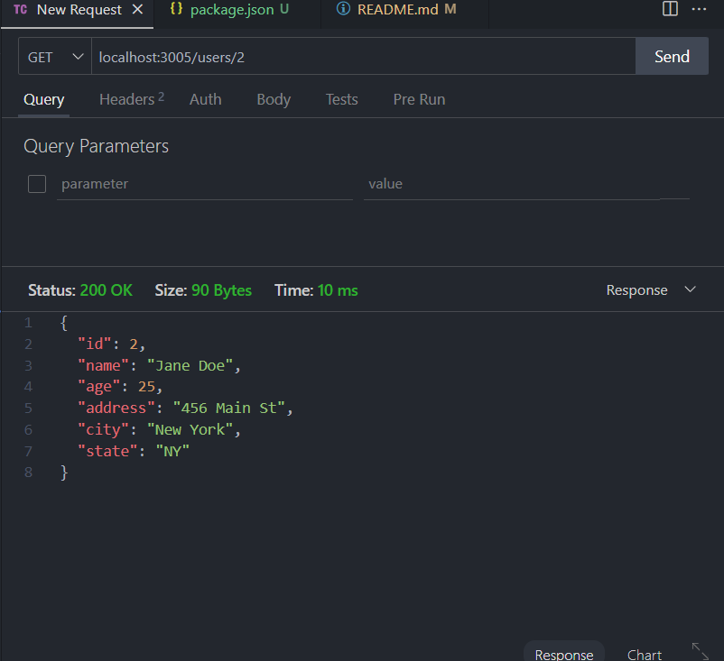
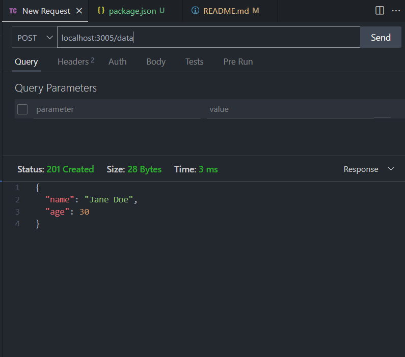
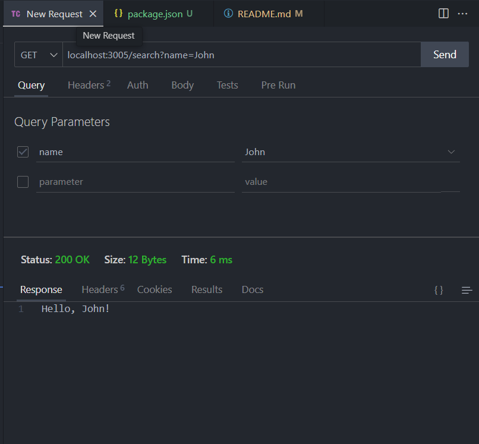

# express-assign-2

Create an Express.js project and create a JSON. Day 2

## Description

This project will allow you to create a JSON file using Express.js. It is a continuation of the assignment from yesterday.

The assignment was to get to GET request and a POST request. I also set up a JSON information for me to get an ideal of how it would look like.

## NODEMON

I used nodemon to watch for any new changes and it allowed the file to be updated on refresh.

```bash
nodemon app.js
```

## APP.GET

I use a GET request for the "/" and the "user/:id. I also used a GET request and query for my "/search".

```js
app.get("/search", (req, res) => {
  const name = req.query.name;
  res.send(`Hello, ${name}!`);
});

app.get("/users/:id", (req, res) => {
  console.log(req.params.id);
  const user = users.find((user) => {
    return user.id === +req.params.id;
  });
  res.status(200).json(user);
});
```

## APP.POST

I used a POST request and a JSON file. It had simple info but it worked.

```js
app.post("/data", (req, res) => {
  res.status(201).json({ name: "Jane Doe", age: 30 });
});
```

## Middleware

I used :

```js
app.use((req, res, next) => {
  res.status(404).json({ message: "Not found" });
});
```

This would show when the user can't find the json file or has an error.

## Thunder Client

I used thunder client to test my app requests.



This is for my "user/:id" GET request.



This is for my "data" POST request.



This was for the search query. It took a parameter to put in the name. Otherwise the name would be undefined.

## Conclusion

I used the thunder client to test my app. I used nodemon to watch for any new changes and it allowed the file to be updated on refresh. We are practicing making a rest API.
